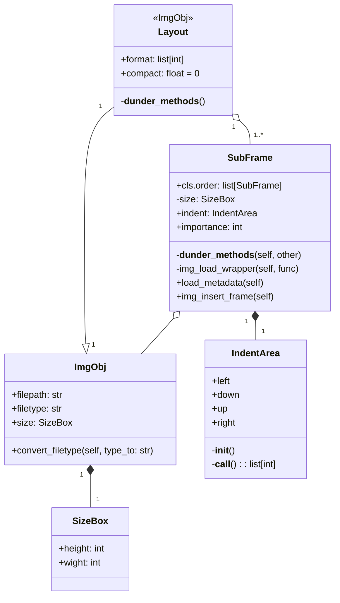

# WebApp TODO
Primary:
- [ ] Асинхронная связь и передачу данных сервера с клиентом  
- [ ] Масштабируемость веб-приложения
- [ ] Выбрать лицензию
- [ ] 

Later:  
- [ ] Предпросмотр результата в браузере
- [ ] Локальное хранилище на стороне клиента (cookie?)
- [ ] Домен
- [ ] 

# Двумерная упаковка в свободном пространстве.
purpose:: 
 "Программа автоматически генерирует коллаж с учётом пользовательских настроек."

user_settings:: 
* general
  * img order by
    * **random** 
    * name
    * data
    * importance
    * custom 
  * (optional) 
    * base **indent**
    * **compact**ness
    * layout settings
      * img **format**
      * img file **type**
      * background fill color
* (optional) each single img
  * **indent** for each side
  * **importance** (_hierarchy_)
  * is **frozen** (_for size and img quality_)
  * **eclipse** depth for each side (_mostly for img with low **importance**, when maximum **compact**ness_)

Категоризация коллажей
--
* **Упорядоченный** - **Неупорядоченный**
  (_Есть ли порядок в расположении фотографий в коллаже?_) 
* **Форматированный** - **Произвольный**
  (_Нужен ли коллаж определённого формата и размера?_)
* **Компактный** - **Обособленный**
  (_Насколько плотно фотографии будут располагаться?_)
* **Исходный** - **Подогнанный**
  (_Можно ли подгонять фотографии по размеру или обрезать?_)

> Приоритет ставится на Неупорядоченный, полу-Компактный, Подогнанный, Произвольный коллаж

Порядок выполнения
---
1. Пользователь вводит список файлов изображения.  
Порядок сортировки файлов может быть не обозначен (по умолчанию ставится случайная выборка фотографий),  
либо задан пользователем: сортировка по имени, по порядку ввода и т.д.  
На основе введённых данных формируется сортированный по принципу пользователя список файлов.
2. Пользователь задаёт настройки для коллажа:  
Соотношение границ, отступы от объектов, процент и границы заступов на фотографии, фон.
3. В соответствии с настройками выбирается алгоритм генерации коллажа
4. Возврат результата

Характеристика для обработки данных пользователем
---
* Градация по размеру (Характеристика распределяет какие фотографии будут сохранять общий размер,  
а какие фото можно будут уменьшить в соотношении с прочими)
* Общий отступ (indent)
* Отступ (indent) для каждой стороны каждого элемента
* Процент заступа для каждой из сторон отдельного объекта
* Кучность объектов
* Формат конечного результата

Алгоритм выполняется через бинарные деревья, с поправкой на диагональную ось симметрии прямоугольника (т.к. большенство фотографий обладают подобной формой), потому дерево можно преобразить до бинарного, где каждая ветка является выбором между стороной корневого объекта, и смещением по краям от этой стороны.

Сортированный список разбивается на 2 по 2 части, в зависимости от ориентации конечного формата коллажа:
* Первая часть будет рассположена сверху-лево, с делением на чётность, нечётность
* Вторая часть будет рассположена снизу-право, с делением на чётность, нечётность

# TODO:
* Нормализация изображений
* Отступы для каждой из сторон
* Принцип кучности
* Принцип неизменности(frozen) изображений
* Алгоритм двумерной упаковка
* Определение размера коллажа

# Проблемы:
## Одно изображение значительно больше другого
Нормализация входных данных на этапе подстановок в конечный результат

